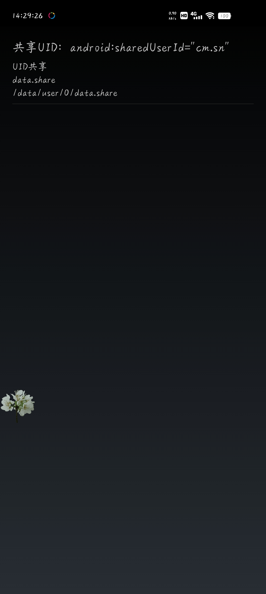
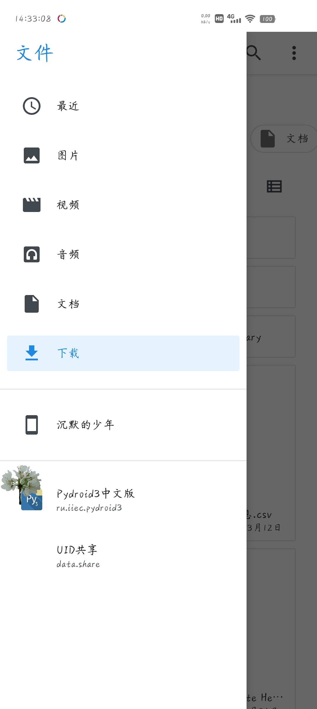

# data共享

## 项目描述
Android数据共享工具，支持文件和数据的共享与传输

## 功能特性
- 文件共享功能
- 数据传输功能
- 主界面操作
- 文件管理功能
- 数据存储管理
- 多设备共享

## 使用说明
打开应用即可进行文件和数据的共享与传输

## 技术实现
- 文件传输协议
- 数据共享机制
- 界面交互设计
- 多设备通信

## 项目结构
```
data共享/
├── app/
│   ├── src/
│   │   └── main/
│   │       ├── AndroidManifest.xml
│   │       ├── java/data/share/MainActivity.java
│   │       └── res/
│   └── build.gradle
├── images/
│   ├── data共享-主界面.jpg
│   └── data共享-文件.jpg
├── build.gradle
├── settings.gradle
└── README.md
```

## 应用截图

### 主界面


### 文件管理
